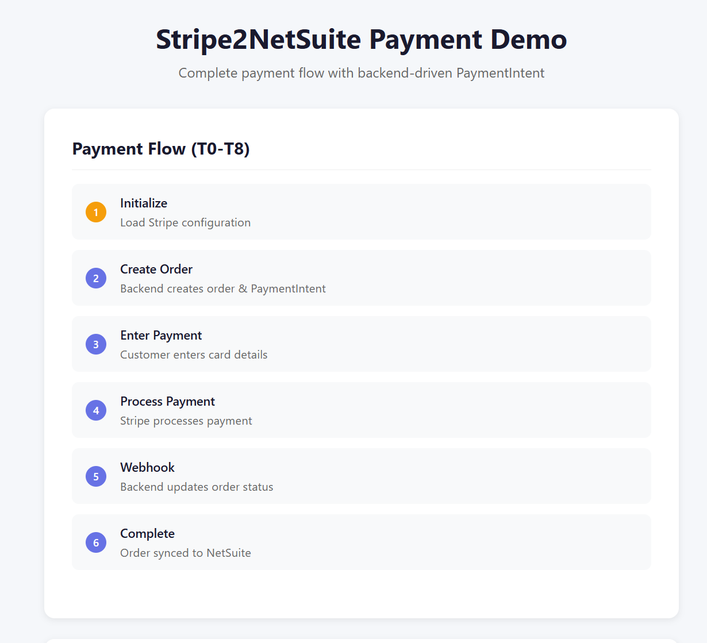
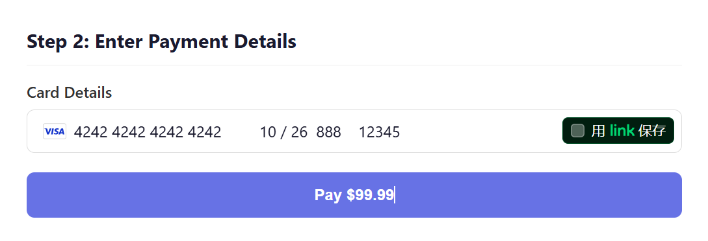
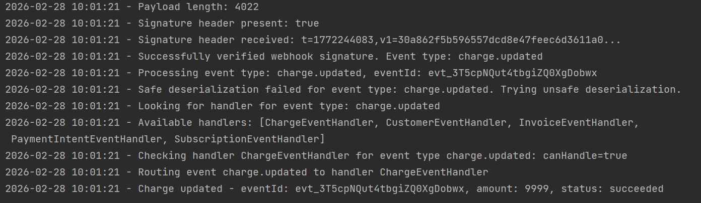

# Stripe2NetSuite Frontend Demo

A React frontend for testing the complete Stripe payment flow with backend-driven PaymentIntent.

## Prerequisites

- Node.js 18+
- Backend running on http://localhost:8080

## Installation

```bash
npm install
```

## Running

```bash
npm run dev
```

The frontend will start on http://localhost:3000

## Features

- **Backend-driven PaymentIntent**: All Stripe logic stays on the backend
- **Complete Payment Flow**: Visual step-by-step display of T0-T8 flow
- **Real-time Status Updates**: See order status change from PENDING to PAID

## How It Works

1. **T0-T2**: Frontend sends order request to backend → Backend creates order and PaymentIntent → Returns clientSecret
2. **T3-T4**: Frontend uses clientSecret with Stripe.js to process payment
3. **T5-T8**: Stripe sends webhook → Backend verifies signature → Updates order to PAID → Syncs to NetSuite





## API Endpoints Used

- `GET /api/orders/config` - Get Stripe publishable key
- `POST /api/orders/create` - Create order with PaymentIntent
- `GET /mock/orders/{id}` - Get order status

## Test Card Numbers

Use Stripe test card numbers:
- Success: `4242 4242 4242 4242`
- Decline: `4000 0000 0000 0002`

Any future expiry and CVC work for test cards.

